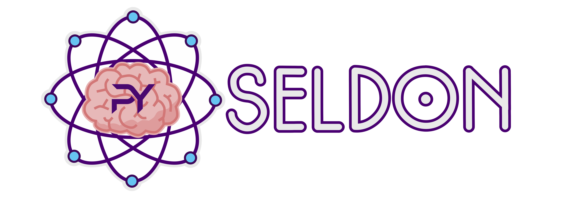

# PySeldon


## Python bindings for the Seldon framework

### Steps to Install and Compile the code

### Installation
Create a new `micromamba` environment and activate it:
```bash
micromamba create -f environment.yml
micromamba activate pyseldonenv
```
If you get problem with micromamba can look at the installation documentation [here](https://mamba.readthedocs.io/en/latest/installation/micromamba-installation.html)

### Build
Set up the build directory with `meson`:
```bash
meson setup build
```

### Install Python package
Use `pip` to install the package:
```bash
pip install .
```

### Run the tests
Use `pytest` to run the tests:
```bash
pytest tests/
```
 or

 ```bash
pytest -s tests/
```
to see the output of the tests without capturing the std output